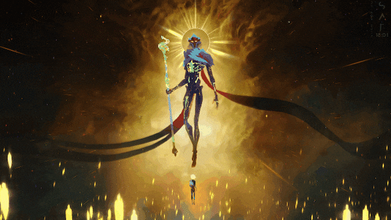
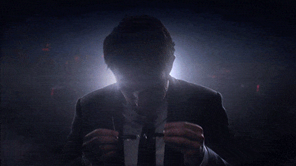

# Homework.-
Masseau Gilbert ODCSE Year 2

<html>
<title> Five (5) of my favorite shows </title>

<body bgcolor="#a6a6a6">

<table border="1">
<th>Name of the Tv shows</th>
<th>Description </th>
<th>Video</th>

<tr>
<td> SpiderMan </td>
<td> American teenager Peter Parker who is bitten by a radioactive spider. As a result of the bite, he gains superhuman strength, speed, and agility, along with the ability to cling to walls, turning him into Spider-Man. </td>
<td>  </td>
</tr>

<tr>
<td> UP (Disney Animation) </td>
<td> The real adventure of life is the relationship we have with other people, and it's so easy to lose sight of the things we have and the people that are around us until they are gone. </td>
<td>  </td>
</tr>

<tr>
<td> Arcane </td>
<td> `Arcane'' tells a tale of two sisters growing up in the neglected undercity of a shining steampunk metropolis. Vi and Powder lost their parents in an act of resistance years ago, and have taken up as thieves. </td>
<td>  </td>
</tr>

<tr>
<td> Flash </td>
<td> This show follows Barry Allen, a forensic scientist in Central City who gains superhuman speed after being struck by lightning during an explosion at the S.T.A.R. Labs particle accelerator. </td>
<td> </td>
</tr>

<tr>
<td> DareDevil </td>
<td> A Marvel series about Matt Murdock, a blind lawyer who fights crime as a vigilante at night. He uses his heightened senses, heightened from a childhood accident, to fight criminals in the dark streets of Hell's Kitchen, facing powerful adversaries like the Kingpin. </td>
<td>  </td>
</tr>

 

<pr> Made by Masseau Gilbert. ODCSE Year 2. </p1r>

 

</table>

</html>
